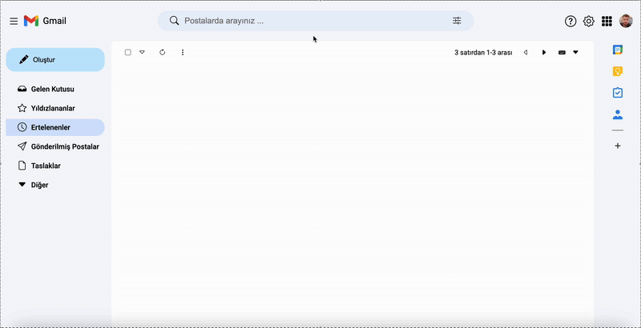

# Gmail Clone Project

    Gmail Clone, Google Gmail arayüzünü temel alarak geliştirilmiş, modern ve sade bir e-posta yönetim arayüzü projesidir. Tanıdık kullanıcı deneyimi, temiz tasarımı ve mail akışını yansıtan yapısıyla gerçek bir ürün hissi sunar.

## Öne Çıkan Özellikler

<ul>
    <li>Gmail’e benzer modern ve sade kullanıcı arayüzü</li>
    <li>Üst arama çubuğu ve aksiyon ikonları</li>
    <li>Sol menü (Gelen Kutusu, Yıldızlananlar, Ertelenenler vb.)</li>
    <li>Mail listeleme alanı (inbox görünümü)</li>
    <li>Responsive yapı (mobil ve masaüstü uyumlu)</li>
</ul>

## Kullanılan Teknolojiler ve Kütüphaneler

<ul>
    <li>HTML5</li>
    <li>CSS3</li>
    <li>SCSS</li>
    <li>JavaScript</li>
    <li>Google Fonts</li>
    <li>BS Icon</li>

</ul>